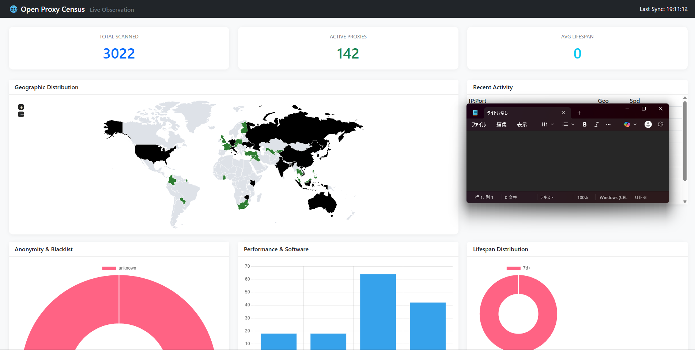

# 🌐 Open Proxy Census

Open Proxy Censusは、世界中に意図せず公開されている「オープンプロキシ」の実態を調査・可視化し、インターネットのセキュリティ向上を目指す高度な研究プロジェクトです。

単なる生存確認に留まらず、プロキシの寿命、ASN/組織（ISP）情報の特定、使用ソフトウェアの種類、悪用率（ブラックリスト登録状況）などを多角的に分析し、時系列データとして蓄積します。

## 📊 リアルタイム・ダッシュボード
起動後、`http://localhost:8080` で以下の統計をリアルタイムに確認できます：



- **世界地図分布**: 国別のプロキシ集中度。
- **組織分析 (ASN/Org)**: Google, AWS, 各国ISPなど、どのインフラで公開されているか。
- **存続寿命 (Lifespan)**: プロキシがどれだけの期間、公開され続けているかの分布。
- **ソフトウェア・フィンガープリント**: Squid, nginx, MikroTik, ZTE等の特定。
- **悪用リスク判定**: DNSBL（Spamhaus等）によるブラックリスト登録状況。

## 🔍 セキュリティ研究の事例
スキャン過程では、意図しない設定ミスにより管理画面が露出しているケースが多数発見されています。

**事例：ルーター管理画面の漏洩（匿名化済み）**
```text
HTTP/1.1 200 OK
Server: ZTE web server 1.0 ZTE corp 2015.
Content-Type: text/html; charset=utf-8
...
<title>ZXHN H199A - Login</title>
```
このような「意図しない公開」を発見し、ASN情報から管理者へフィードバックを行うことが、本プロジェクトの最終的な目標の一つです。

## ⚖️ 日本の法律と安全性への配慮
本システムは、日本の法律（不正アクセス禁止法、威力業務妨害等）を遵守し、安全に研究を行うために以下の配慮を行っています。

- **非侵入型スキャン**: パスワード試行や脆弱性攻撃は一切行いません。公開ポートへの接続確認のみを実行します。
- **負荷制御**: `config.yaml` により並列ワーカー数を調整可能。同一ターゲットへの過度な負荷を防ぎます。
- **閲覧専用モードの推奨**: ネットワーク通信を行わずに蓄積データを分析できるモードを搭載しています。

## 🚀 実行モード

### 1. フルスキャン・モード
収集、検証、分析、保存を全て同時に行います。
```bash
go run cmd/proxy-census/main.go
```

### 2. 閲覧専用モード (推奨)
蓄積されたデータ（`data/census.db`）を使い、ダッシュボードのみを起動します。
ネットワークにパケットを送信しないため、最も安全に分析が可能です。
```bash
go run cmd/proxy-census/main.go --server-only
```

## ⚙️ システム・アーキテクチャ
Goルーチンによる多段パイプライン構造を採用。

```text
[ Collector ] ──> [ Proxy Tester ] ──> [ Analyzer ] ──> [ Storage ]
      │                (2,000 workers)      (200 workers)        │
      └─ 公開リスト取得      └─ 生存/国判定        └─ ソフト特定         └─ SQLite (WAL)
         ASN/Org特定         応答速度計測          ブラックリスト照合     履歴(History)記録
```

## 🛠 技術スタック
- **Language**: Go
- **Database**: SQLite (WALモード / 履歴管理対応)
- **Visualizer**: Chart.js, jsVectorMap, Bootstrap 5
- **Intelligence**: ip-api.com, DNSBL, WHOIS

## 📝 免責事項
本プロジェクトは教育および情報提供を目的としています。使用に伴ういかなる損害についても責任を負いません。法的な境界線を理解した上で、善意のセキュリティ向上に役立ててください。
